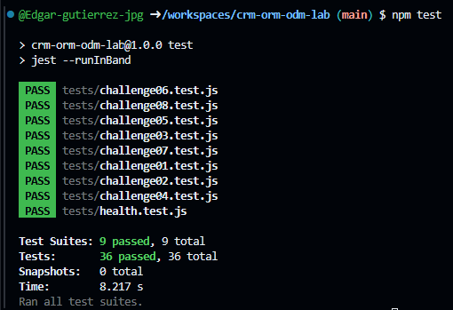

# CRM ORM/ODM Lab

API REST de un CRM básico que combina un ORM (Sequelize + PostgreSQL) y un ODM (Mongoose + MongoDB).

## Stack

- Node.js 22, Express 5, CommonJS
- Sequelize + PostgreSQL 16 (`User`, `Company`, `Contact`)
- Mongoose + MongoDB 7 (`Activity`)
- Jest + Supertest
- GitHub Codespaces, Dev Containers, Docker Compose
- Supervisor (`npm run dev`)

## Arquitectura

```text
GitHub Codespace
│
├── app       Node.js 22  ──┬── Sequelize ──> postgres (PostgreSQL)
│                           └── Mongoose  ──> mongo    (MongoDB)
├── postgres
└── mongo
```

La aplicación se conecta por nombre de servicio (`postgres`, `mongo`). Las credenciales de desarrollo llegan como variables de entorno definidas en `.devcontainer/docker-compose.yml` (ver `.env.example`).

## Iniciar el Codespace

1. En GitHub: **Code → Codespaces → Create codespace on main**.
2. Espera a que se levanten los tres servicios (`app`, `postgres`, `mongo`). `postCreateCommand` ejecuta `npm install`.

## Instalar dependencias

```bash
npm install
```

## Seed y reset

```bash
npm run seed    # inserta datos deterministas (3 users, 4 companies, 8 contacts, 10 activities)
npm run reset   # elimina y recrea tablas/base de datos y vuelve a sembrar
```

## Iniciar la API

```bash
npm start       # node ./bin/www
npm run dev     # supervisor ./bin/www
```

Servidor en el puerto `3000` (variable `PORT`).

## Pruebas

```bash
npm test
```

Cada suite restablece PostgreSQL y MongoDB antes de ejecutarse y cierra las conexiones al terminar.

## Endpoints

| Método | Ruta | Descripción |
|---|---|---|
| GET | `/health` | Health check |
| GET | `/users` | Listar usuarios |
| GET | `/users/:id` | Obtener usuario |
| POST | `/users` | Crear usuario |
| PUT | `/users/:id` | Actualizar usuario |
| DELETE | `/users/:id` | Eliminar usuario |
| GET | `/companies` | Listar compañías (`?industry=`) |
| GET | `/companies/:id` | Obtener compañía |
| POST | `/companies` | Crear compañía |
| PUT | `/companies/:id` | Actualizar compañía |
| DELETE | `/companies/:id` | Eliminar compañía |
| GET | `/contacts` | Listar contactos |
| GET | `/contacts/:id` | Obtener contacto |
| POST | `/contacts` | Crear contacto |
| PUT | `/contacts/:id` | Actualizar contacto |
| DELETE | `/contacts/:id` | Eliminar contacto |
| GET | `/activities` | Listar actividades (`?type=`) |
| GET | `/activities/:id` | Obtener actividad |
| POST | `/activities` | Crear actividad |
| PUT | `/activities/:id` | Actualizar actividad |
| DELETE | `/activities/:id` | Eliminar actividad |

Los errores se devuelven como JSON: `{ "error": "Contact not found" }`.

## Respuestas

**1. Dos motores.**
Activity es ideal para una base documental porque su campo "metadata" tiene una estructura variable que cambia según si es una llamada, correo o reunión. Company y Contact encajan mejor en una relacional porque tienen esquemas fijos y relaciones estructuradas muy claras entre sí.

**2. ORM vs ODM.**
Un ORM (Sequelize) mapea objetos a tablas de una base de datos relacional, mientras que un ODM (Mongoose) mapea objetos a documentos de una base de datos NoSQL. La diferencia principal es que el ORM maneja esquemas estrictos y relaciones complejas, y el ODM maneja esquemas más flexibles.

**3. Configuración por variables de entorno.**
En Codespaces, las credenciales se definen en las variables de entorno inyectadas al contenedor. Es mala práctica escribirlas en los archivos .js porque se exponen públicamente al subir el código a GitHub.

**4. Asociaciones.**
En models/sequelize/index.js, una Company tiene muchos Contacts, y un Contact pertenece a una Company. La llave foránea es companyId, que vive en la tabla Contact. El alias as: contacts sirve para nombrar la propiedad donde se guardará el arreglo de contactos al hacer eager loading.

**5. Eager loading.**
Traerlos en la misma consulta con include es preferible porque Sequelize genera un solo JOIN en SQL, obteniendo toda la información de la base de datos de manera mucho más eficiente en un solo viaje.

**6. Instancia vs consulta.**
Buscar primero la instancia permite validar si el registro existe para responder un error 404, y devuelve el objeto completo ya actualizado. Usar Model.update directamente es más rápido porque es una sola consulta SQL, pero devuelve un arreglo con el número de filas afectadas, no el objeto modificado.

**7. Esquema flexible.**
En models/mongoose/activity.js, metadata usa el tipo mongoose.Schema.Types.Mixed, lo que desactiva la validación estricta de Mongoose para ese campo y permite guardar cualquier estructura JSON. Su desventaja es que perdemos las validaciones automáticas de tipos de datos que sí tenemos en los otros campos definidos.

**8. Sin ref.**
No se puede usar ref/populate porque los IDs pertenecen a PostgreSQL, y Mongoose solo puede hacer populate con documentos que viven dentro de MongoDB. La consecuencia es que si se borra un User en PostgreSQL, sus actividades en MongoDB quedarán "huérfanas" apuntando a un userId inexistente.

**9. Documento actualizado.**
La actualización devolvía el documento original antes del cambio porque ese es el comportamiento por defecto de findByIdAndUpdate. Para solucionarlo, agregue la opción { new: true, runValidators: true } para que Mongoose validara los datos y devolviera el documento ya modificado.

**10. Pruebas de comportamiento.**
Probar la respuesta de la API en lugar de la implementación asegura que la API cumple su contrato con el cliente. Esto permite refactorizar o cambiar la lógica interna sin tener que reescribir las pruebas si el comportamiento externo es el mismo.

**11. Repetibilidad.**
El archivo tests/setup.js borra todas las tablas y colecciones y vuelve a insertar los datos semilla exactos antes de cada prueba. Esto es necesario para asegurar que las pruebas no dependan del orden en que se ejecutan y que los datos modificados por una prueba no hagan fallar a la siguiente.

**12. Tu experiencia.**
El reto más difícil para mí fue el 08. Al principio, la prueba de Jest fallaba indicando que el valor devuelto no coincidía con el esperado, ya que se regresaba el documento original. Para resolverlo, tuve que buscar documentación y modifiqué la función update agregando las opciones { new: true, runValidators: true } a findByIdAndUpdate, logrando así que Mongoose devolviera el documento ya modificado y respetara el esquema. Más que difícil fue tedioso porque se tuvo que buscar documentación.

## Evidencia

